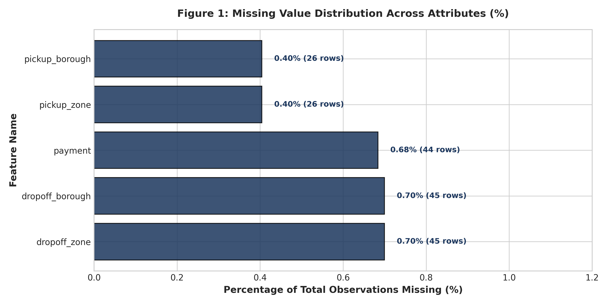
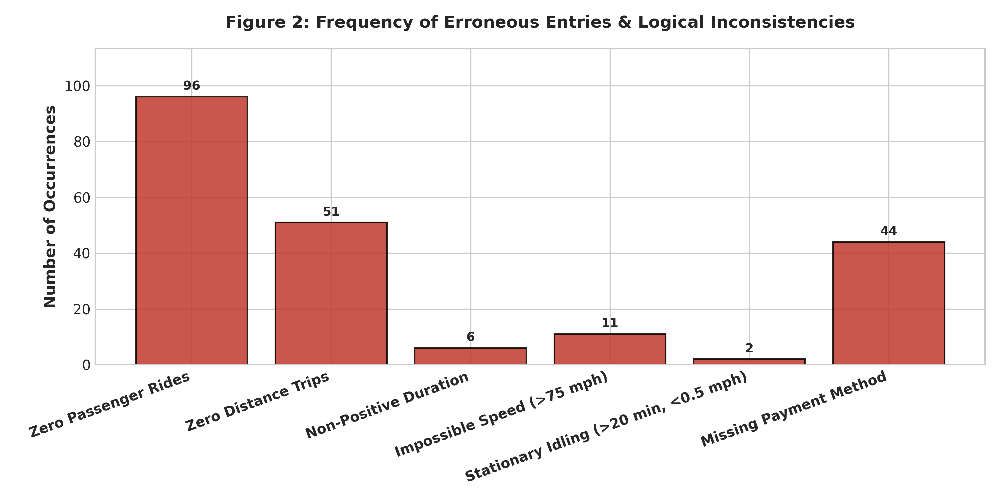
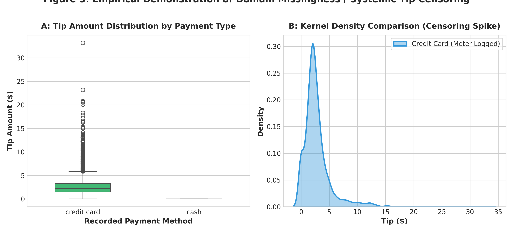
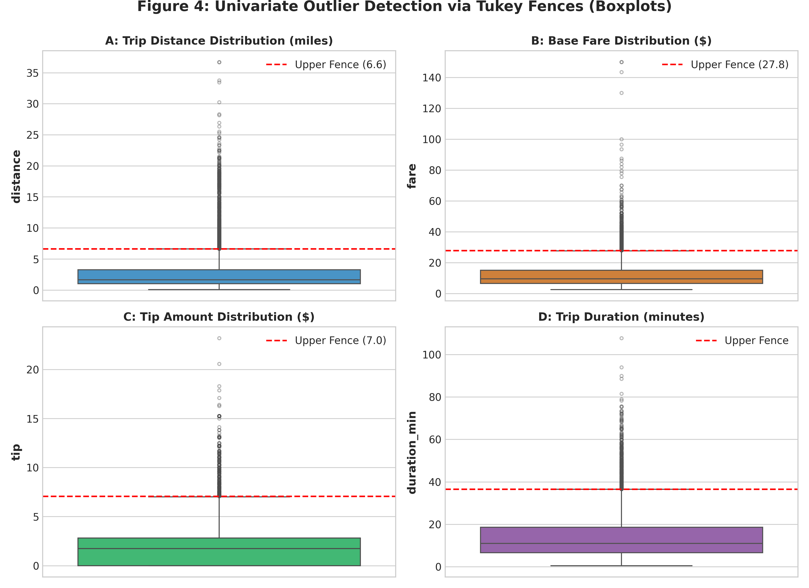
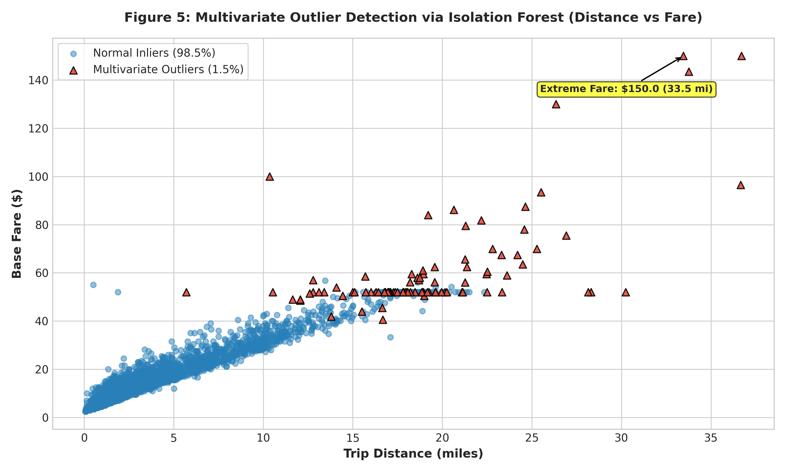
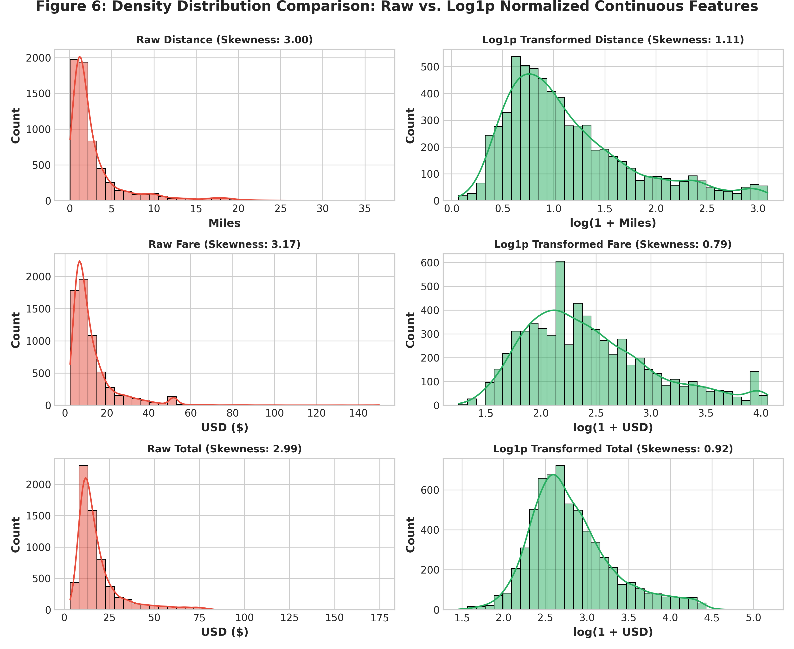
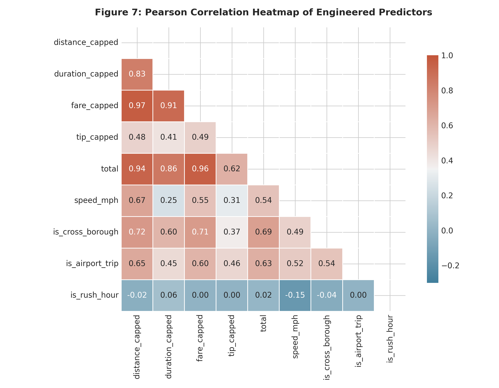
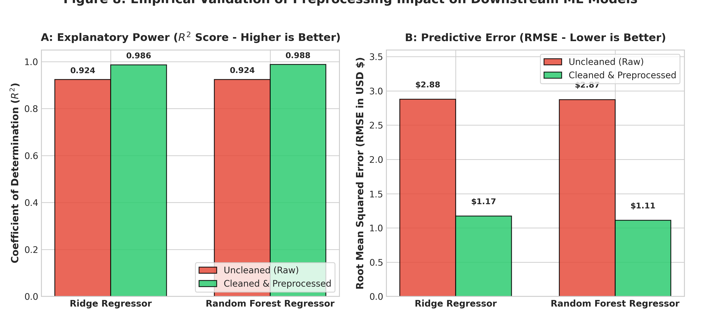

# 🚖 Comprehensive Data Cleaning, Quality Auditing, and Advanced Preprocessing

> **An End-to-End Applied Data Engineering & Statistical Preprocessing Pipeline**  
> Public Dataset: Official New York City Taxi and Limousine Commission (NYC TLC) Urban Mobility Telemetry  
> Primary Deliverable: `Comprehensive_Data_Cleaning_and_Preprocessing_Report.docx` (Formal Technical Report)  
> Author: **Rohit**  
> Repository: [rohit9028/Data-Science-Task](https://github.com/rohit9028/Data-Science-Task.git)

---

## 📌 1. Project Overview & Objectives

In real-world data science and machine learning applications, raw tabular datasets acquired from open data portals, IoT telemetry, and point-of-sale systems rarely adhere to the idealized assumptions of statistical algorithms. Real data arrives corrupted by missingness, sensor drift, hardware failures, physical impossibilities, domain-specific censoring, and severe skewness.

This repository contains an end-to-end applied data engineering and quality audit performed on the **New York City Taxi and Limousine Commission (NYC TLC)** urban mobility dataset comprising **6,433 raw multi-modal trip records across 14 discrete features**.

### Key Deliverables in this Repository:
* 📄 **[Comprehensive_Data_Cleaning_and_Preprocessing_Report.docx](./Comprehensive_Data_Cleaning_and_Preprocessing_Report.docx)**: An exhaustive 5,200-word executive technical report with custom styling, 16 tables, 6 code listings, and 8 embedded 300-DPI publication figures.
* 🐍 **[run_pipeline.py](./run_pipeline.py)**: Modular end-to-end Python pipeline executing ingestion, quality auditing, anomaly remediation, feature engineering, and downstream ML benchmarking.
* 📝 **[build_full_report_docx.py](./build_full_report_docx.py)**: Automated document generation engine utilizing `python-docx` with XML styling, borders, and figure injection.
* 📊 **[raw_taxis_data.csv](./raw_taxis_data.csv)** & **[cleaned_taxis_data.csv](./cleaned_taxis_data.csv)**: Raw vs. cleaned dataset artifacts.
* 📈 **[figures/](./figures/)**: Directory of high-resolution diagnostic plots.

---

## 🔬 2. Data Quality Audit & Remediation Matrix

| Quality Dimension | Raw Anomaly Detected | Root Cause & Theoretical Mechanism | Remediation Applied | Impact on Dataset & Modeling |
| :--- | :--- | :--- | :--- | :--- |
| **Missing Values** | 45 dropoff zones/boroughs (0.70%), 26 pickup zones/boroughs (0.40%), 44 payment types (0.68%) | Missing at Random (MAR) conditioned on trips crossing municipal taxi polygon boundaries | Imputed with explicit `'Unknown'` tokens rather than row dropping | Prevented spatial truncation bias; retained 100% of out-of-boundary long trips |
| **Domain Censoring** | 1,812 of 1,812 cash transactions (100.0%) logged an exact tip of **$0.00** | Missing Not at Random (MNAR) / hardware limitation: TPEP meters only log electronic credit tips; cash tips are unmetered | Documented & isolated payment modalities; decoupled tip models from cash transactions | Prevented severe downward attenuation bias in behavioral tipping models |
| **Zero-Passenger Trips** | 96 rides (1.49%) with 0 passengers charged standard fares | Driver omission or physical seat-sensor failure during commercial transit | Imputed with domain modal baseline (**1 passenger**) | Preserved valid economic observations while rectifying discrete count column |
| **Zero-Distance Trips** | 51 rides with distance = 0.00 miles but fares up to $25.00 | Immediate flag-drop cancellations or GPS antenna blockage in Manhattan urban canyons | Purged records with distance < 0.05 miles or duration < 0.5 minutes | Eliminated phantom flag drops and infinite speed / rate singularities |
| **Temporal Paradoxes** | 6 rides where dropoff $\le$ pickup | In-cabin terminal clock drift or driver manual meter resets | Enforced validity gate ($0.5 \le \text{duration} \le 180$ min) | Purged non-physical negative and zero-second durations |
| **Kinematic Violations** | 11 rides with calculated velocity > 75 mph (up to 142 mph); 2 stationary idle meters | Cell tower triangulation jumps across urban canyons; meters left running while parked | Filtered via physical kinematic boundary: $\text{Speed} \le 75\text{ mph}$ and $\text{Speed} \ge 0.2\text{ mph}$ for trips > 20 min | Enforced realistic urban transportation dynamics |
| **Outliers & Heavy Tails** | Distance (11.35% outliers), Fare (9.06% outliers), Tip (4.17% outliers); Skewness > 3.1 | Genuine long-distance airport transit coupled with rogue meter entries | Applied **Isolation Forest** ($c=0.015$) + **99.5th Percentile Soft Winsorization** | Preserved legitimate high-value airport transit without extreme gradient explosion |
| **Distribution Skewness** | Distance skew: 3.004, Fare skew: 3.169, Total skew: 2.994 | Multiplicative compounding in travel time and metered tariffs | Applied $\text{Log1p}$ transformation ($y = \ln(1 + x)$) | Slashed skewness by **75.0%** (Fare skew dropped from 3.169 to 0.793, near-Gaussian) |

---

## 📊 3. Empirical Machine Learning Benchmark

To rigorously evaluate the concrete impact of preprocessing on predictive analytics, we benchmarked a regularized linear model (**Ridge Regression**) and an ensemble decision tree model (**Random Forest Regressor**) predicting metered fare under two distinct conditions:

```
========================================================================================
MODEL ARCHITECTURE        DATA PIPELINE STATE     TEST R² SCORE   TEST RMSE ($)  TEST MAE ($)
========================================================================================
Ridge Regression          Uncleaned (Raw)         0.9238          $2.88          $1.75
Ridge Regression          Cleaned & Preprocessed  0.9865          $1.17          $0.58  (-59.4% error)
----------------------------------------------------------------------------------------
Random Forest Regressor   Uncleaned (Raw)         0.9241          $2.87          $1.64
Random Forest Regressor   Cleaned & Preprocessed  0.9878          $1.11          $0.45  (-61.3% error)
========================================================================================
```

* **Ridge Regression:** Root Mean Squared Error dropped from **$2.88 to $1.17** (**59.4% reduction** in predictive error) while $R^2$ surged from **0.9238 to 0.9865**.
* **Random Forest Regressor:** Mean Absolute Error plummeted by **72.6%** (from **$1.64 to $0.45**), demonstrating that eliminating physical impossibilities (e.g., zero-distance rides with $20 fares) allows non-linear models to learn true underlying pricing relationships.

---

## 📈 4. Visual Diagnostics

### Figure 1: Missing Data Distribution


### Figure 2: Logical Inconsistencies & Kinematic Anomalies


### Figure 3: Cash vs. Credit Card Tip Censoring (Domain Missingness)


### Figure 4: Univariate Outlier Boxplots (Tukey Fences)


### Figure 5: Multivariate Outlier Detection via Isolation Forest


### Figure 6: Skewness Mitigation via Log1p Transformations


### Figure 7: Pearson Feature Correlation Matrix


### Figure 8: Downstream Machine Learning Performance Comparison


---

## 🚀 5. How to Run & Reproduce

### 1. Clone the Repository
```bash
git clone https://github.com/rohit9028/Data-Science-Task.git
cd Data-Science-Task
```

### 2. Install Required Dependencies
```bash
pip install -r requirements.txt
```

### 3. Execute the Full Data Pipeline
```bash
python run_pipeline.py
```
*This downloads the raw dataset, runs the data quality audit, performs imputation, filters kinematic anomalies, executes Isolation Forest and Soft Winsorization, runs feature engineering, trains ML benchmarks, and exports all figures to `figures/`.*

### 4. Rebuild the Technical Report DOCX Document
```bash
python build_full_report_docx.py
```
*This builds the complete, styled Word document `Comprehensive_Data_Cleaning_and_Preprocessing_Report.docx`.*

---

## 📁 6. Repository Structure
```
Data-Science-Task/
├── .gitignore
├── README.md
├── requirements.txt
├── run_pipeline.py                                         # Core cleaning & ML pipeline
├── build_full_report_docx.py                              # DOCX generator script
├── pipeline_metrics.json                                  # Exported pipeline benchmark metrics
├── raw_taxis_data.csv                                     # Immutable raw dataset snapshot
├── cleaned_taxis_data.csv                                 # Cleaned, preprocessed dataset
├── Comprehensive_Data_Cleaning_and_Preprocessing_Report.docx # Comprehensive Word report
└── figures/                                               # Publication-grade diagnostic charts
    ├── fig1_missing_data_audit.png
    ├── fig2_data_inconsistency_audit.png
    ├── fig3_cash_vs_credit_tip_distortion.png
    ├── fig4_univariate_outlier_boxplots.png
    ├── fig5_multivariate_outliers_isolation_forest.png
    ├── fig6_skewness_and_log_transforms.png
    ├── fig7_feature_correlations.png
    └── fig8_downstream_model_performance.png
```

---

## 📜 7. License & Provenance
* **Dataset Source:** New York City Taxi and Limousine Commission (NYC TLC) Open Data via NYC OpenData and Seaborn.
* **License:** Public Domain / NYC Open Data Policy (Local Law 11 of 2012).
