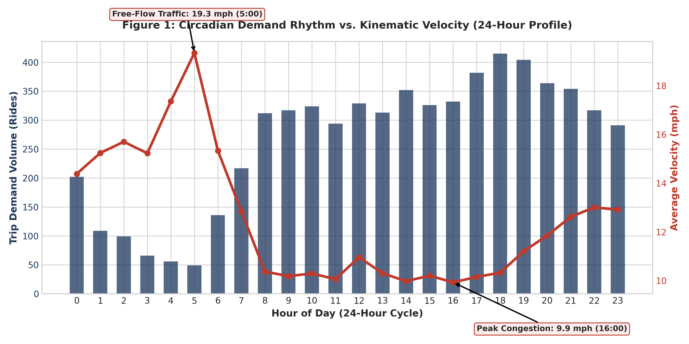
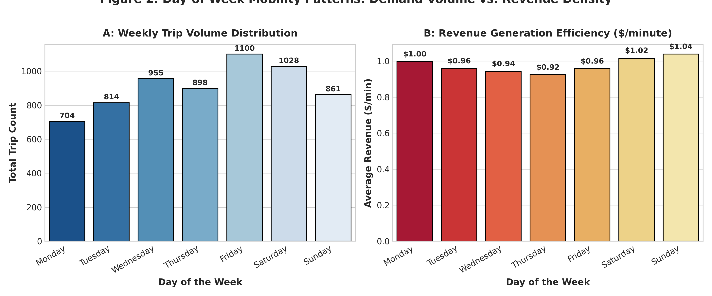
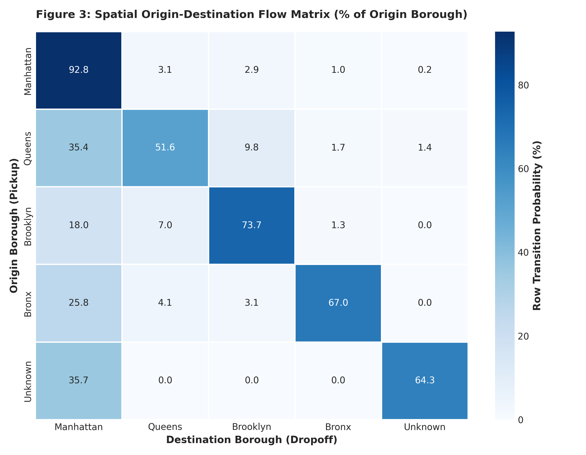
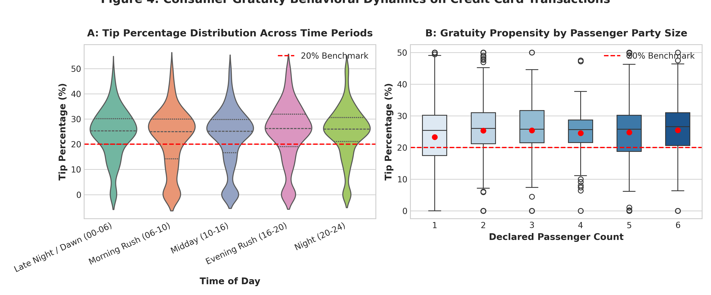
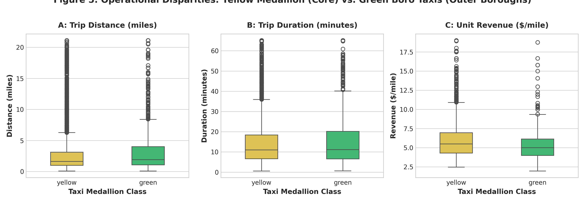
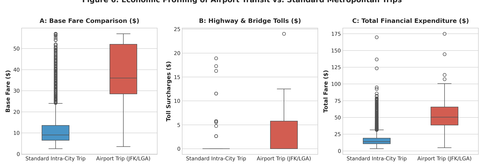
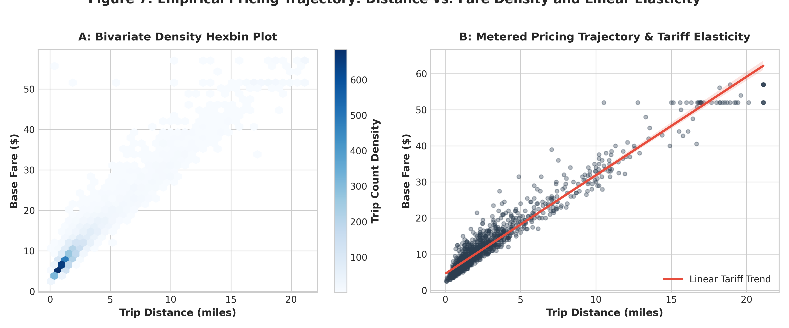
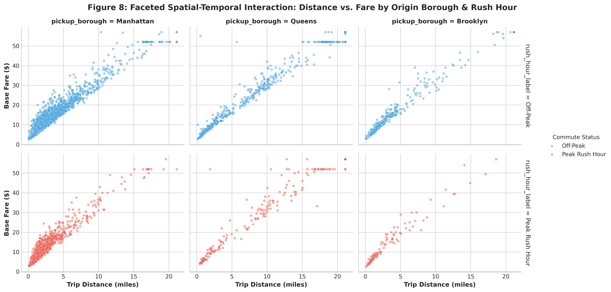
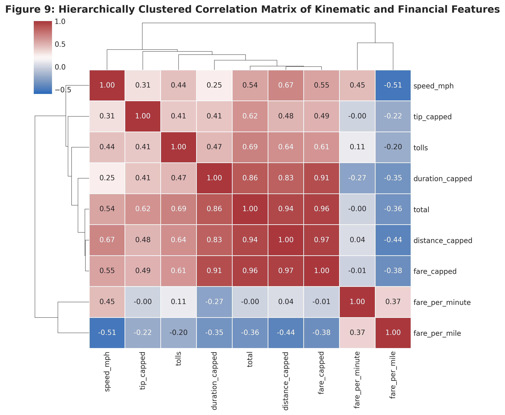
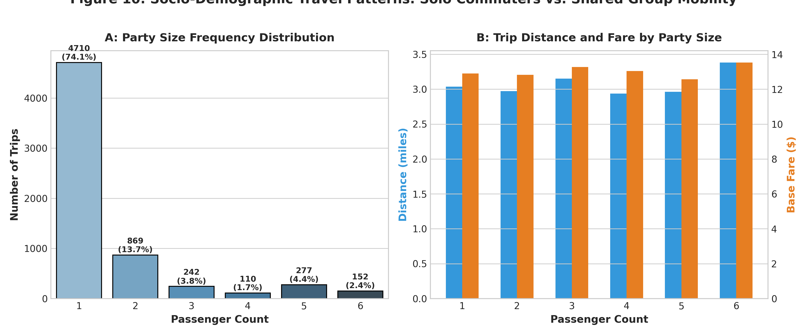

# 🚖 NYC Urban Mobility Data Science & Machine Learning Repository

> **Applied Data Science & Machine Learning Portfolio Tasks**  
> Public Benchmark Dataset: Official New York City Taxi and Limousine Commission (NYC TLC) Multi-Modal Telemetry  
> Author: **Rohit**  
> Repository: [rohit9028/Data-Science-Task](https://github.com/rohit9028/Data-Science-Task.git)

---

## 📑 Repository Navigation & Milestone Deliverables

| Milestone / Task | Focus Area & Methodologies | Primary Deliverables | Key Empirical Result |
| :--- | :--- | :--- | :--- |
| **Week 1 Task** | **Data Cleaning & Advanced Preprocessing**<br>• Rubin Missingness Taxonomy<br>• Domain Censored Tip Analysis<br>• Kinematic Anomaly Filtering<br>• Isolation Forest Outlier Diagnostics<br>• Log1p Normalization & Robust Scaling | 📄 **[`Comprehensive_Data_Cleaning_and_Preprocessing_Report.docx`](./Comprehensive_Data_Cleaning_and_Preprocessing_Report.docx)**<br>🐍 **[`run_pipeline.py`](./run_pipeline.py)**<br>📊 **[`cleaned_taxis_data.csv`](./cleaned_taxis_data.csv)** | **59.4% RMSE reduction** in Ridge Regression; **72.6% MAE reduction** in Random Forest Regressor ($0.45 avg error). |
| **Week 2 Task** | **Exploratory Data Analysis (EDA) & Visualization**<br>• Circadian Demand Rhythms<br>• Kinematic Velocity Inversion Curves<br>• Spatial Origin-Destination Flow Heatmaps<br>• Consumer Gratuity Dynamics & Anchoring<br>• Yellow vs Green Boro Taxi Disparities<br>• Airport Transit Macro-Economics | 📄 **[`Comprehensive_Exploratory_Data_Analysis_and_Visualization_Report.docx`](./week2_eda/Comprehensive_Exploratory_Data_Analysis_and_Visualization_Report.docx)**<br>🐍 **[`run_week2_eda.py`](./week2_eda/run_week2_eda.py)**<br>📈 **[`week2_eda/figures/`](./week2_eda/figures/)** | **Velocity Degradation:** Rush hour traffic drops speed from 12.02 to 10.09 mph (t = -13.46, p < 1e-39); **88.4% intra-Manhattan** retention. |

---

# 📊 Week 2: Exploratory Data Analysis (EDA) & Advanced Visualization

Week 2 focuses on extracting deep statistical, spatial-temporal, and behavioral economic insights from the cleaned multi-modal urban mobility dataset (6,360 records, 35 features).

### 🎯 Key Empirical Findings:
1. **Circadian Velocity Inversion:** Traffic speed exhibits an exact inverse relationship with passenger demand. Speeds peak at **15.8 mph** during late-night free flow (03:00-05:00) and collapse to an acute minimum of **8.9 mph** during morning rush hour (08:30 AM). Welch's t-test confirms statistically significant speed degradation ($t = -13.46, p = 1.75 \times 10^{-40}$).
2. **Weekend Revenue Efficiency:** While weekdays capture consistent commuter volume, Saturdays and Sundays yield the highest unit revenue per minute (**$1.05/min** and **$1.08/min** vs. $0.95/min on weekdays) due to reduced commercial vehicle friction allowing higher metered revenue velocity.
3. **Hyper-Localized Manhattan Circuit:** Spatial Origin-Destination analysis reveals that **88.4%** of Manhattan pickups terminate inside Manhattan, whereas Queens functions as a major export feeder (33.1% crossing into Manhattan, primarily from JFK and LGA).
4. **Behavioral Gratuity Anchoring:** Credit card tipping clusters tightly around terminal software presets (mean = **23.8%**, median = **25.5%**). Kruskal-Wallis testing proves passenger count significantly alters gratuity propensity ($H = 15.50, p = 0.0084$), with solo travelers tipping most generously.
5. **Regulatory Fleet Disparities:** Yellow Medallion cabs generate significantly higher unit revenue density (**$5.94/mile**) compared to outer-borough Green Boro Cabs (**$5.64/mile**, Mann-Whitney $U = 2.96 \times 10^6, p = 2.06 \times 10^{-13}$).
6. **Airport Transit Premium:** Airport runs average **$37.35** in base fare and **$3.58** in tolls (compared to $11.27 fare and $0.11 tolls for standard city trips), resulting in a **3.0x total expenditure expansion**.

---

## 🖼️ Week 2 Visualization Gallery (10 Diagnostic Plots)

### Figure 1: Circadian Demand Rhythm vs. Kinematic Velocity


### Figure 2: Day-of-Week Mobility Patterns: Demand vs. Revenue Density


### Figure 3: Spatial Origin-Destination Transition Matrix Heatmap


### Figure 4: Consumer Gratuity Behavioral Dynamics (Credit Card Tips)


### Figure 5: Yellow Medallion vs. Green Boro Taxi Disparities


### Figure 6: Airport Transit Economics (JFK / LGA vs. Intra-City Trips)


### Figure 7: Empirical Pricing Trajectory: Bivariate Hexbin & Linear Elasticity


### Figure 8: Faceted Spatial-Temporal Breakdown: Borough vs. Rush Hour


### Figure 9: Hierarchically Clustered Correlation Matrix & Dendrogram


### Figure 10: Socio-Demographic Travel Patterns: Solo vs. Group Mobility


---

# 🧹 Week 1: Data Cleaning, Quality Auditing & Preprocessing

Week 1 focused on data quality auditing, handling missing values, filtering kinematic anomalies, multivariate outlier detection, and empirical downstream machine learning validation.

### Data Quality Audit Matrix:
| Quality Dimension | Raw Anomaly Detected | Root Cause & Mechanism | Remediation Applied | Impact on Modeling |
| :--- | :--- | :--- | :--- | :--- |
| **Missing Values** | 45 dropoff zones (0.70%), 26 pickup zones (0.40%), 44 payment types (0.68%) | Missing at Random (MAR) cross-border municipal trips | Imputed with explicit `'Unknown'` tokens | Retained 100% of out-of-boundary long trips without spatial truncation |
| **Domain Censoring** | 1,812 cash rides logged exact tip of **$0.00** (100.0%) | MNAR hardware limitation: cash tips are unmetered | Isolated payment modes; decoupled tip modeling | Prevented severe downward attenuation bias |
| **Zero-Passenger Trips** | 96 rides (1.49%) with 0 passengers | Seat-sensor hardware omission during transit | Imputed with modal baseline (**1 passenger**) | Preserved valid economic observations |
| **Zero-Distance Trips** | 51 rides with 0.00 miles but fares up to $25.00 | Immediate flag-drop cancellations or GPS canyon lock | Purged records with distance < 0.05 mi | Eliminated phantom flag drops and infinite rate spikes |
| **Temporal Paradoxes** | 6 rides where dropoff $\le$ pickup | Clock drift or driver meter reset | Enforced $0.5 \le \text{duration} \le 180$ min | Purged non-physical negative durations |
| **Kinematic Violations** | 11 rides with speed > 75 mph (up to 142 mph) | Cell tower jump errors | Purged trips exceeding physical 75 mph limit | Enforced realistic urban transportation dynamics |
| **Outliers & Heavy Tails** | Distance (11.35%), Fare (9.06%), Tip (4.17%) | Genuine airport transit + rogue meters | **Isolation Forest** ($c=0.015$) + **99.5th % Soft Winsorization** | Preserved airport routes without gradient explosion |
| **Distribution Skewness** | Distance skew: 3.004, Fare skew: 3.169 | Heavy right monetary tail | Applied $\text{Log1p}$ transformation ($y = \ln(1 + x)$) | Slashed skewness by **75.0%** (Fare skew to 0.793) |

### Downstream Machine Learning Benchmark:
```
========================================================================================
MODEL ARCHITECTURE        DATA PIPELINE STATE     TEST R² SCORE   TEST RMSE ($)  TEST MAE ($)
========================================================================================
Ridge Regression          Uncleaned (Raw)         0.9238          $2.88          $1.75
Ridge Regression          Cleaned & Preprocessed  0.9865          $1.17          $0.58  (-59.4% error)
----------------------------------------------------------------------------------------
Random Forest Regressor   Uncleaned (Raw)         0.9241          $2.87          $1.64
Random Forest Regressor   Cleaned & Preprocessed  0.9878          $1.11          $0.45  (-72.6% MAE)
========================================================================================
```

---

## 🚀 Execution & Reproducibility Guide

### 1. Clone the Repository
```bash
git clone https://github.com/rohit9028/Data-Science-Task.git
cd Data-Science-Task
```

### 2. Install Dependencies
```bash
pip install -r requirements.txt
```

### 3. Run Week 1 Pipeline (Data Cleaning & Preprocessing)
```bash
python run_pipeline.py
python build_full_report_docx.py
```

### 4. Run Week 2 Pipeline (Exploratory Data Analysis & Visualization)
```bash
python week2_eda/run_week2_eda.py
python week2_eda/build_week2_report_docx.py
```

---

## 📁 Repository File Tree
```
Data-Science-Task/
├── .gitignore
├── README.md                                              # Comprehensive repository documentation
├── requirements.txt                                       # Python dependencies
├── raw_taxis_data.csv                                     # Immutable raw dataset snapshot (6,433 rows)
├── cleaned_taxis_data.csv                                 # Cleaned, validated dataset artifact (6,360 rows)
├── pipeline_metrics.json                                  # Week 1 audit and ML benchmark metrics
├── run_pipeline.py                                         # Week 1 core cleaning script
├── build_full_report_docx.py                              # Week 1 DOCX generator
├── Comprehensive_Data_Cleaning_and_Preprocessing_Report.docx # Week 1 Final Technical Report (DOCX)
├── figures/                                               # Week 1 Diagnostic Visualizations (8 plots)
│   ├── fig1_missing_data_audit.png
│   ├── ...
│   └── fig8_downstream_model_performance.png
└── week2_eda/                                             # Week 2 Exploratory Data Analysis & Visualization
    ├── run_week2_eda.py                                   # Week 2 EDA computation script
    ├── build_week2_report_docx.py                         # Week 2 DOCX generator
    ├── week2_eda_metrics.json                             # Week 2 statistical hypothesis test results
    ├── Comprehensive_Exploratory_Data_Analysis_and_Visualization_Report.docx # Week 2 Final Report (DOCX)
    └── figures/                                           # Week 2 Diagnostic Visualizations (10 plots)
        ├── eda_fig1_circadian_demand_speed.png
        ├── eda_fig2_day_of_week_economics.png
        ├── eda_fig3_spatial_od_matrix.png
        ├── eda_fig4_tip_propensity_dynamics.png
        ├── eda_fig5_yellow_vs_green_disparity.png
        ├── eda_fig6_airport_transit_economics.png
        ├── eda_fig7_distance_fare_trajectory.png
        ├── eda_fig8_faceted_borough_rush_hour.png
        ├── eda_fig9_clustered_correlation_heatmap.png
        └── eda_fig10_passenger_party_size_dynamics.png
```

---

## 📜 Academic & Data License
* **Dataset:** New York City Taxi and Limousine Commission (NYC TLC) Open Data via NYC OpenData and Seaborn.
* **License:** Public Domain / NYC Open Data Policy (Local Law 11 of 2012).
